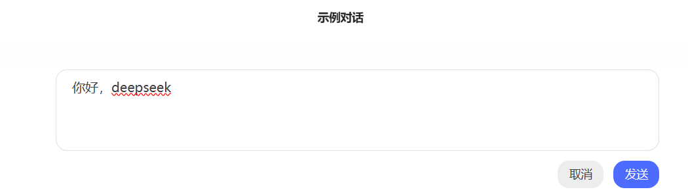
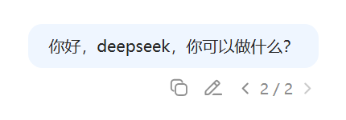

# DeepSeekChatWebHistoryGET


一个用于提取 [DeepSeek Chat](https://chat.deepseek.com/) 网页版聊天记录的浏览器用户脚本。它通过分析已加载页面的 DOM 结构，安全、高效地获取并整理您的对话历史。

您可以选择直接在浏览器控制台中复制提取的文本，或者**可选地**配合一个轻量级的本地 Python 服务器，将聊天记录自动保存为结构化的 JSON 和 Markdown 文件，便于长期存档和后续处理。

在window系统下可用。

---


## 项目原理与免责声明

### 工作原理
本工具是一个**浏览器辅助脚本（增强功能类）**，其工作原理如下：
1.  **用户触发**：脚本仅在您主动按下特定按钮（F6键或页面上的按钮）后运行。
2.  **本地操作**：脚本只在您**已经打开并登录**的 DeepSeek Chat 浏览器标签页内运行。
3.  **DOM 分析**：它分析当前浏览器页面中的 DOM 结构，定位到聊天记录所在的 HTML 元素。
4.  **内容提取与整理**：脚本读取这些元素的文本内容，并将其整理成清晰、可读的格式。
5.  **输出**：最终，它会把聊天记录打印在控制台，或通过 HTTP POST 请求将数据发送至本地运行的 Python 服务器进行保存。

### 本质与类比
- **本质**：该脚本**没有**向 DeepSeek 的服务器发送任何额外的、非正常的请求。它只是在帮用户更高效地操作用户**已经加载到本地的**浏览器页面内容，其操作范围完全限定在用户自己的浏览器标签页内。
- **类比**：这就好比一个帮用户自动整理浏览器书签的插件，或者一个可以批量下载网页上图片的助手。它只是一个提高效率的工具。

### 免责声明
此工具仅用于**个人学习和数据备份目的**。请确保您使用此工具的行为符合 DeepSeek 的服务条款。开发者对因使用此工具而产生的任何问题概不负责。

---

## 功能特性

- **一键提取**：通过快捷键 `F6` 或点击页面按钮 `聊天记录提取` 快速触发。
- **无损格式化**：提取的对话记录保持清晰的对话轮次（用户user 与 助手assistant）和代码块格式。
- **本地处理**：所有数据处理均在浏览器本地或您的本地计算机上完成，隐私安全。
- **多格式导出（可选）**：配合 Python 服务器，可自动保存为：
  - **JSON** (`*.json`)：保留完整的结构化数据，便于程序处理。
  - **Markdown** (`*.md`)：提供优美且可读性强的对话记录，适合阅读和分享。
- **无依赖服务器**：Python 服务器仅使用标准库，无需安装额外包。

---

## 安装与使用

### 第一部分：安装用户脚本 (UserScript)

1.  **安装用户脚本管理器**：
    如果您还没有安装，需要在浏览器上安装一个用户脚本管理器扩展。
    - 安装 [Tampermonkey](https://www.tampermonkey.net/)。

2.  **安装脚本**：
    - 复制或下载本项目中的 [`UserScript.js`](./UserScript.js) 文件。
    - 到 Tampermonkey等脚本管理器 安装这个`UserScript.js`。

### 第二部分：（可选）配置本地 Python 服务器

此步骤是可选的。如果您只想在浏览器控制台查看记录或手动复制，可以跳过这一步。但本服务器代码可以提供文件保存（JSON和Markdown格式）。

1.  **确保已安装 Python**：
    - [Download Python](https://www.python.org/downloads/)

2.  **下载并运行服务器**：
    - 将本项目中的 [`DSchatHistoryGET.py`](./DSchatHistoryGET.py) 文件下载到您的电脑上。
    - 打开终端、命令行或资源管理器，导航到该文件所在的目录。
    - 确保本地端口 `3141` 可用。
    - 运行`DSchatHistoryGET.py`。
    - **保持窗口打开**，服务器会持续运行并监听来自浏览器脚本的请求。

### 第三部分：提取聊天记录

1.  打开浏览器并访问 [DeepSeek Chat](https://chat.deepseek.com/)。
2.  **登录您的账户**。
3.  在左侧对话列表中选择一个您想要保存的对话。
4.  等待对话内容完全加载到页面中。

5.  **触发提取**：
    - **方法一**：直接按下键盘上的 **`F6`** 键。
    - **方法二**：留意页面右下角，脚本可能会添加一个悬浮按钮 **`聊天记录提取`** ，点击它即可。
6.  **取消提取**：
    - 当正在提取时，你会在网页右上角看到**进度条**，此时可以进行取消提取操作。
    - **方法一**：再次按下键盘上的 **`F6`** 键。
    - **方法二**：原悬浮按钮文本变为 **`取 消`** ，再次点击它即可。
7.  **提取结果**：
    - **如果 Python 服务器未运行**：提取的聊天记录文本会在浏览器的开发者工具控制台（按F12 打开）中打印出一个格式化的对象数组，您可以直接在此查看。
    - **如果 Python 服务器正在运行**：脚本会将数据发送到服务器。成功保存后，您会在服务器终端窗口看到对应提示。保存的文件（`标题_日期时间.json/md` 如 `深夜人为什么会这么闲_20250828_233117.md`）会位于 `DSchatHistoryGET.py` 同级目录下的 **`DSchatHistory`** 文件夹中。

---

## 导出文件的结构通式

### 导出JSON的结构通式

```json
{
  "title": "string",               // 对话标题
  "timestamp": "string",          // ISO 8601时间戳
  "total_messages": "number",     // 消息总数
  "messages": [                   // 消息数组
    {
      "index": "number",          // 消息序号（从0开始）
      "role": "string",           // 角色标识（如：user、assistant）
      "content": "string"         // 消息内容
    }
  ]
}
```

1.  根对象属性
    - **title**: 字符串类型，对话的标题或主题
    - **timestamp**: 字符串类型，ISO 8601格式的时间戳（YYYY-MM-DDTHH:mm:ss.sssZ）
    - **total_messages**: 数字类型，消息总数
    - **messages**: 数组类型，包含所有消息对象

2.  消息对象属性
    - **index**: 数字类型，消息的序号（从0开始递增）
    - **role**: 字符串类型，标识消息发送者角色
        - 可用值：`"user"`（用户）、`"assistant"`（AI助手）
        - `"system"`（系统）值不存在
    - **content**: 字符串类型，消息的实际内容

3.  [**`示例对话 JSON`**](./示例对话.json)，点击查看历史聊天记录示例，JSON格式。

### 导出Markdown的结构通式

```markdown
# [对话标题]

**导出时间**: [ISO 8601时间戳]  
**总消息数**: [数量]  

---

> # [序号] [角色]

[消息内容]

---

> # [序号] [角色]

[消息内容]

---

`- ω -`
```

1.  **注:**
    - 此处的 `[序号]` 从 1 开始递增。
    - 此处的 `[角色]` 为`AI`或`用户`。
  
2.  [**`示例对话 Markdown`**](./示例对话.md)，点击查看历史聊天记录示例，Markdown格式。

---

## 项目文件说明

- [**`UserScript.js`**](./UserScript.js)：核心的用户脚本文件，负责在浏览器中提取和整理聊天内容。
- [**`DSchatHistoryGET.py`**](./DSchatHistoryGET.py)：可选的本地 Python 服务器，用于接收脚本发送的数据并保存为文件。
- `README.md`：本项目说明文档。
- [*`示例对话.json`*](./示例对话.json)：提供的历史聊天记录示例，JSON格式。
- [*`示例对话.md`*](./示例对话.md)：提供的历史聊天记录示例，Markdown格式。
- [*`0.png`*](./0.png)：这是下方的编辑界面图片。
- [*`1.png`*](./1.png)：这是下方的对话分支图片。


## 备注

- 如果你在编辑修改对话，请点**取消**或**发送**后再提取聊天记录，**否则**处于修改状态的消息**不会**被记录。
    

- 得到的聊天记录只有**当前**显示的时间线，**不会**得到分支的线。
    
    如在此图显示下，只会得到消息2，不会得到消息1。

- 由于是根据页面的DOM结构获取的聊天记录，**可能**会在官方网站更新后**失效**。
  
- 本仓库所有的文件由Deepseek提供原始文件，再由本人细细完善修改。

## 分享

- [飞书剪存](https://microsoftedge.microsoft.com/addons/detail/%E9%A3%9E%E4%B9%A6%E5%89%AA%E5%AD%98/bblmnlacihobkmjjkbmeojakgpcnpnfk?hl=zh-CN)也可以完成聊天记录提取的功能(不过似乎不能区分用户与AI,只会导出成Markdown文件)。

---

`- ω -`